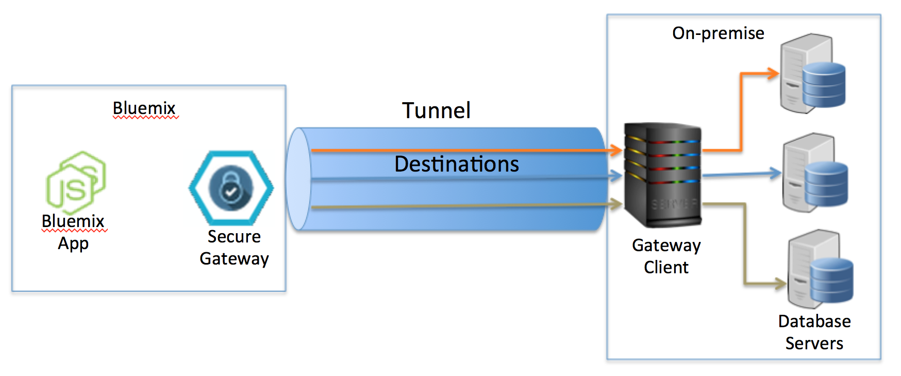
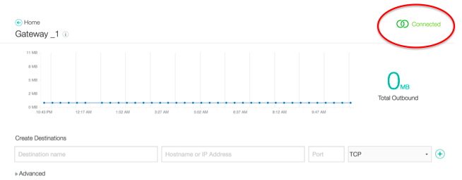
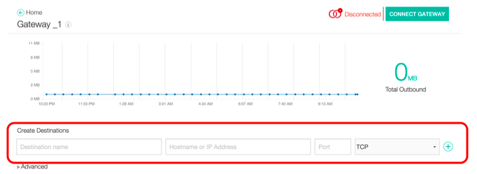
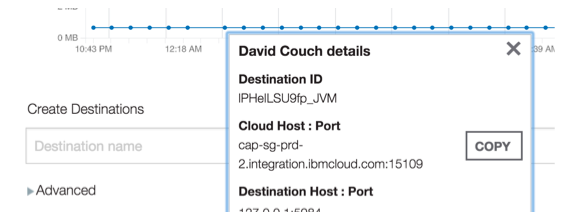
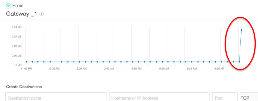
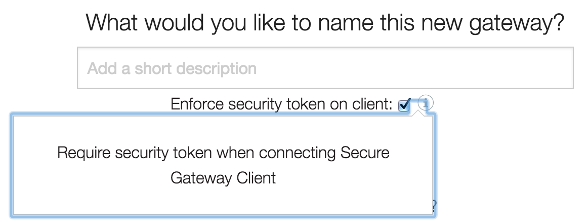

# Hybrid Cloud Tutorial Part 1: Create a Secure Gateway 
See how easy it is to unlock your data for use in mobile and web applications, or for more flexible analysis and reporting. Bluemix Secure Gateway service lets you move data from on-premises to the cloud in a secure manner. This is a multi-part tutorial which shows how to set up a gateway and then build an app on top of it. Here, in Part 1, we’ll cover:

- Secure gateway architecture overview
- How to set up a secure gateway client

## Why use a secure gateway?

Lots of enterprises have valuable data they need to protect. To keep sensitive data secure, databases are often stored on-premises within an organization’s physical location, where staff can protect it more easily. But more and more, organizations also want to host data in the cloud for easy availability and integration with analytics and mobile or web apps. They're looking to take data out of their system of record and open it to one or more systems of engagement.

Secure gateway lets you safely connect to an on-premises database. It works by creating a secure tunnel through which you can access protected data. The gateway encrypts and authenticates user connections, to prohibit unauthorized access. It’s a way to open your on-premises data to the cloud and enjoy the flexibility, security, and scalability that it offers.

## How secure gateway works

One gateway can connect to many on-premises data sources. In this tutorial, we're using Bluemix, IBM's cloud platform, to create the gateway. Here's a simplified version of what we're doing here in Part 1: 

1. We'll create a new Secure Gateway on Bluemix, which generates a gateway ID. We'll use that ID to start the gateway client in our on-premises network.

    _**Optional, but smart:** You can add additional security by enforcing the use of a security token when starting the client._
3. Start the gateway client.
4. Create one or more destinations (data sources) to your on-prem database servers. Each destination will have its own port on the Bluemix server.
5. Test the connection by accessing your data from your a browser or a bluemix app, through the url given for each destination.

Here's how the different pieces connect together. 
<p align="center"></p>

## Set up a secure gateway

In this tutorial, we’ll set up a secure gateway for access a sample Apache CouchDB<sup>TM</sup> database. The point of using CouchDB is to verify that the Secure Gateway instance works. You can replace it with any database of your choice to achieve the same results. 

## Install Docker client

Docker Engine is a lightweight runtime and packaging tool for apps.  Docker works best on Linux OS. If you want to use Docker on Mac or Windows, just install the helper app, Boot2Docker.  You’ll find all the details and instructions at  https://docs.docker.com/installation/#installation. Just choose your operating system and follow the  instructions.

## Add Bluemix secure gateway service and connect
Now we’re ready to set up the gateway.

1. Go to the Bluemix site: https://console.ng.bluemix.net/
2. Sign up or sign in.

   If you’re new to Bluemix, you can sign up for a free trial. 

3. Within the left-hand menu, click **Services**.

4. Click **+ Add a service or API**.
5. Scroll down to **Integration** and click **Secure Gateway**.

    _**Tip:** Most Bluemix services run entirely on the cloud. Secure Gateway is the rare exception to this rule, since its very purpose is to securely connect to on-prem data sources. So, it requires both cloud-platform-side and on-premises processes._ 

6. On the upper right of the screen, click the **APP** dropdown and choose **Leave unbound**.
7. Click **Create**.

   The Secure Gateway page opens. 

    _**Note:** If you haven’t yet installed the Docker client, you must go do so now (see previous section)._

8. Click **Add Gateway**.
9. Enter any name you want for the gateway.
10. Click **Connect it**.
11. Under **How would you like to connect this gateway?** choose **Docker**.
12. Copy the text and, if you’re on Mac or Windows, add additional text.

    If you’re on Linux, this command works fine as-is. But for Mac and Windows, you need to insert the following additional text, right after `docker run`

   ``` --net=host ```

    Insert spaces on either side. The beginning of the line should look like this:

   ``` docker run --net=host -it ibmcom/secure-gateway-client… ```

13. Go to your computer’s command line, paste in the text, and press Enter.

   Your gateway client is now connected to Bluemix. 

<p align="center">
<p align="center"><i><strong>Connected!</strong> If you go back and open the gateway in Bluemix, 
status in the upper right corner shows as Connected.</i></p>

   Leave your terminal command line window open. You’ll return to it in a few minutes.


## Set destination

Next, we must set the data source endpoint. This will be the on-premises source database we want to share out to the cloud. For the purposes of this tutorial, we’ll use a simple CouchDB database.

1. On your on-prem laptop or computer, install CouchDB.

    Visit http://couchdb.apache.org/, then download and installCouchDB.
2. In Bluemix, add the destination.
 
    Return to or open the gateway in Bluemix. Under **Create Destinations** Enter a name for the connection. Then enter the IP address and port of the on-prem machine where your couchDB database resides and click the +plus button on the far right of the line (use 127.0.0.1 if CouchDB is installed on the current laptop)

    <p align="center">

3. If you're on Windows or Mac, configure Boot2Docker to provide access to the data.

    On Windows and Mac, you must allow access through multiple containers. To do so, open a new instance of Boot2Docker and run the following command--inserting your own IP and port information. (If couchDB is running on your local laptop, you can use 127.0.0.1 for the host and 5984 for the port, which are the default settings.)
    
``` bash-3.2$ boot2docker ssh -R 127.0.0.:5984:127.0.0.1:5984 ```

> **Tip:** If you want to see what just ran, open up your Terminal command line and at the `cli>` prompt type `loglevel TRACE`

## Test the connection

Now you'll see some results. Follow these steps to view your local couchDB data from outside your network.

1. On a laptop or machine outside your on-premise network, open a browser and sign in to Bluemix.
2. Locate the secure gateway connection you created and click its i information button.
3. Beside the destination, click **Copy**.

    <p align="center">

4. Open another browser window and paste the string into the address bar. At the end of the string, type `/_utils` so the address looks like this:

    ``` http://cap-sg-prd-2.integration.ibmcloud.com:15109/_utils/ ```

5. Press Enter.

   You'll see your couchDB dashboard (Futon app) appear. That's it!  Your database is now accessible from outside your on-premises network!
   
   You saw it happen, and so did Bluemix. In Bluemix, return to or open the gateway. The chart shows a spike in traffic.


<p align="center"></p>

   Now you know how create a secure gateway that opens your on-prem data to the cloud. You can try these same steps  with  MYSQL, DB2, MongoDB, or any other databases you use on-premises. 

## Configuring security for your gateway
There are 2 types of security to consider. You can:

- **Require a security token when starting the gateway client.** This is useful if you want to control who can start the gateway client. To do so, when you add the gateway, turn on the **Enforce Security Token on Client** checkbox.

<p align="center"></p>

Once , you see the security token in Gateway details (beside the key icon) for use when starting the gateway on the client:

``` docker run --net=host -it ibmcom/secure-gateway-client <gatewayid> --sectoken <token>```

- **_(Advanced)_ Extend TLS encryption between the gateway client and your on-prem data source.** To do so, click the **Enable client TLS** checkbox located in the **Advanced** section of the destination configuration. Optionally, you can upload a certificate file (.pem extension). Note: You do not have to do this step if the certificate is self-signed.


## Stay tuned...
...for additional parts of this tutorial which will show you how to build an app that leverages the secure gateway. After that, we'll learn how to include data sets from multiple sources (cloud-based and local) for combination and analysis. 

<sup>© "Apache", "CouchDB", "Apache CouchDB" and the CouchDB logo are trademarks or registered trademarks of The Apache Software Foundation. All other brands and trademarks are the property of their respective owners.</sup>
